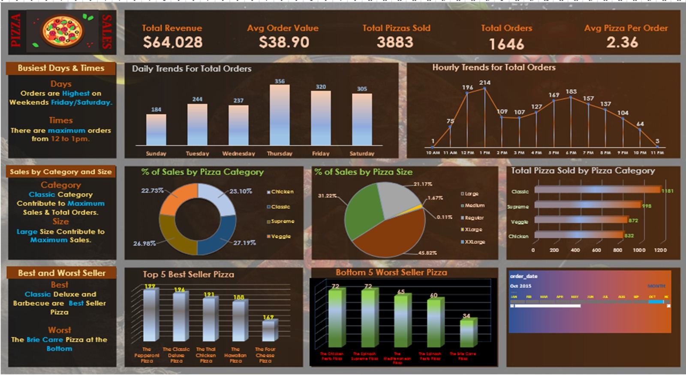

# Pizza-Sales-Dashboard
Interactive Excel dashboard analyzing pizza sales data

# 🍕 Pizza Sales Dashboard (Excel Project)

## 📌 Project Overview
This project presents an interactive Pizza Sales Dashboard built using Microsoft Excel. The dashboard provides insights into sales performance, customer trends, and product demand using visual analytics.

The goal of this project is to transform raw sales data into meaningful insights that can help in making better business decisions.

---

## 🎯 Objective
- Analyze overall business performance  
- Identify top-selling pizzas  
- Understand customer ordering patterns  
- Track revenue trends over time  

---

## 📊 Key Insights
- 💰 Total Revenue generated from pizza sales  
- 📦 Total number of orders placed  
- 🍕 Best-selling pizza categories and sizes  
- ⏰ Hourly order trends (peak business hours)  
- 📅 Monthly sales performance analysis  

---

## 🛠 Tools & Techniques Used
- Microsoft Excel  
- Pivot Tables  
- Pivot Charts  
- Slicers (for interactivity)  
- Data Cleaning & Formatting  

---

## 📷 Dashboard Preview
![Dashboard Preview] 
(dashboard_preview.png).jpeg

## 🎥 Dashboard Demo Video
[Watch the Dashboard Demo]()

## 🎥 Dashboard Demo

---

## ✨ Features
- Interactive dashboard using slicers  
- Dynamic charts for real-time filtering  
- Clean and user-friendly layout  
- Business-focused insights  

---

## 📁 Files Included
- `pizza_sales_dashboard.xlsx` → Main dashboard file  
- `dashboard_preview.png` → Dashboard screenshot  
- `dataset.csv` → Raw dataset (if included)  

---

## 💡 What I Learned
- How to clean and organize raw data in Excel  
- Building interactive dashboards using slicers  
- Creating meaningful visualizations  
- Extracting actionable business insights from data  

---

## 🚀 Future Improvements
- Add forecasting for future sales  
- Enhance dashboard design with advanced visuals  
- Integrate with Power BI for deeper analysis  

---

## 🤝 Connect with Me
If you found this project interesting or have suggestions, feel free to connect with me!

---

⭐ If you like this project, don’t forget to give it a star!
